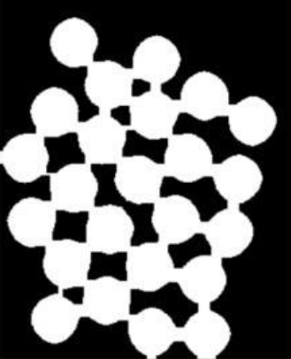
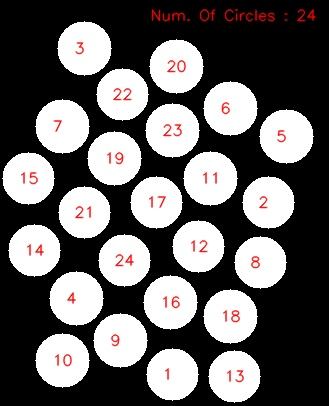

# Hough-Circles

A simple example on how to use hough circles
 
## Folder Structure:
```
📦Hough-Circles
 ┣ 📂Media
 ┃ ┗ 📂Q1
 ┃ ┃ ┗ 📜Q1image.png
 ┣ 📂Results
 ┃ ┗ 📜results.png
 ┣ 📜README.md
 ┗ 📜hough_circles_example.py
```
## How To Run:

* Navigate to the root of this package.
* Ensure the Python file is executable 
* then enter the following:
```
python hough_circles_example.py
```

## Results 

<table>
 <tr>
    <td> <p align='center'>Original Image</p></td>
    <td> <p align='center'>Final Result</p></d>
 </tr>
</table>

